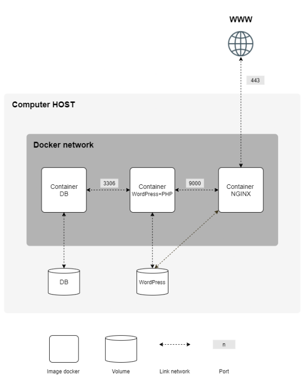

# Inception

## Table of Contents
- [Description](#description)
- [Project Overview](#project-overview)
- [Usage](#usage)
- [Resources](#resources)

## Description
The Inception project aims to broaden your knowledge of system administration by using Docker. You will virtualize several Docker images, creating them in your new personal virtual machine. The project consists of setting up a small infrastructure composed of different services under specific rules, all done in a virtual machine using Docker Compose.

The mandatory part requires setting up:
- A Docker container with NGINX that uses TLSv1.2 or TLSv1.3 protocol
- A Docker container with WordPress + php-fpm
- A Docker container with MariaDB
- A volume for the WordPress database
- A volume for the WordPress website files
- A Docker network to connect the containers

## Project Overview
### Directory Structure:
```
.
├── .git/
├── .gitignore
├── Makefile
├── README.md
├── images
│   └── container-diagram.png
└── srcs
    ├── .env
    ├── docker-compose.yml
    └── requirements
        ├── mariadb
        │   ├── Dockerfile
        │   └── tools
        │       └── run.sh
        ├── nginx
        │   ├── Dockerfile
        │   └── conf
        │       └── wordpress.conf
        └── wordpress
            ├── Dockerfile
            └── tools
                └── run.sh
```

### Container Diagram:


## Usage
Clone the project and change directory into the repository using:
```
git clone https://github.com/Taanviir/Inception.git && cd Inception
```

To interact with this project, various commands can be executed in the root directory:
- `make`: Builds and starts all containers
- `make down`: Stops and removes all containers and networks
- `make build`: Builds images without using cache
- `make clean`: Stops containers, removes images and volumes
- `make dry-run`: Checks if Docker Compose works without starting containers
- `make info`: Displays information about containers, images, networks, volumes
- `make logs-<service>`: Shows logs for a specific service (e.g: make logs-nginx)
- `make exec-<service>`: Runs a shell inside a specific service (e.g: make logs-mariadb)

## Resources
- [Inception #42 project — PART I | by ssergiu | Medium](https://medium.com/@ssterdev/inception-guide-42-project-part-i-7e3af15eb671)

### Docker Fundamentals and Best Practices
- [Complete Intro to Containers (btholt.github.io)](https://btholt.github.io/complete-intro-to-containers/)
- [Best practices for building containers | Cloud Architecture Center | Google Cloud](https://cloud.google.com/architecture/best-practices-for-building-containers)
- [Online Docker Training Course for the Beginner | KodeKloud](https://kodekloud.com/courses/docker-for-the-absolute-beginner/)
- [Docker Explained (youtube.com)](https://www.youtube.com/watch?v=WoZobj2Ruj0)
- [Learn Docker in 12 Minutes 🐳 (youtube.com)](https://www.youtube.com/watch?v=YFl2mCHdv24)
- [Never install locally, there's a better way (youtube.com)](https://www.youtube.com/watch?v=J0NuOlA2xDc)
- [Virtual Machines vs Containers (youtube.com)](https://www.youtube.com/watch?v=eyNBf1sqdBQ)

### Docker Compose Overview
- [Docker Compose overview | Docker Docs](https://docs.docker.com/compose/)
- [Docker Compose in 12 Minutes (youtube.com)](https://www.youtube.com/watch?v=Qw9zlE3t8Ko)

### WordPress with PHP-FPM
- [php - Official Docker Image | Docker Hub](https://hub.docker.com/_/php)
- [wp core download – WP-CLI Command | Developer.WordPress.org](https://developer.wordpress.org/cli/commands/core/download/)
- [wp core – WP-CLI Command | Developer.WordPress.org](https://developer.wordpress.org/cli/commands/core/)
- [wp config create – WP-CLI Command | Developer.WordPress.org](https://developer.wordpress.org/cli/commands/config/create/)
- [wp core install – WP-CLI Command | Developer.WordPress.org](https://developer.wordpress.org/cli/commands/core/install/)
- [Server Environment – Make WordPress Hosting](https://make.wordpress.org/hosting/handbook/server-environment/)

### MariaDB
- [MariaDB - Alpine Linux](https://wiki.alpinelinux.org/wiki/MariaDB)
- [mariadb - Official Docker Image | Docker Hub](https://hub.docker.com/_/mariadb)
- [What is SQL? - Structured Query Language (SQL) Explained - AWS (amazon.com)](https://aws.amazon.com/what-is/sql/)

### NGINX with TLSv1.2/TLSv1.3
- [nginx - Official Docker Image | Docker Hub](https://hub.docker.com/_/nginx)
- [Beginner’s Guide (nginx.org)](https://nginx.org/en/docs/beginners_guide.html#conf_structure)
- [openssl(1): OpenSSL tool - Linux man page (die.net)](https://linux.die.net/man/1/openssl)
- [SSL, TLS, HTTP, HTTPS Explained (youtube.com)](https://www.youtube.com/watch?v=hExRDVZHhig)
- [The NGINX Crash Course (youtube.com)](https://www.youtube.com/watch?v=7VAI73roXaY)
- [Learn Proper NGINX Configuration Context Logic - YouTube](https://www.youtube.com/watch?v=C5kMgshNc6g)
